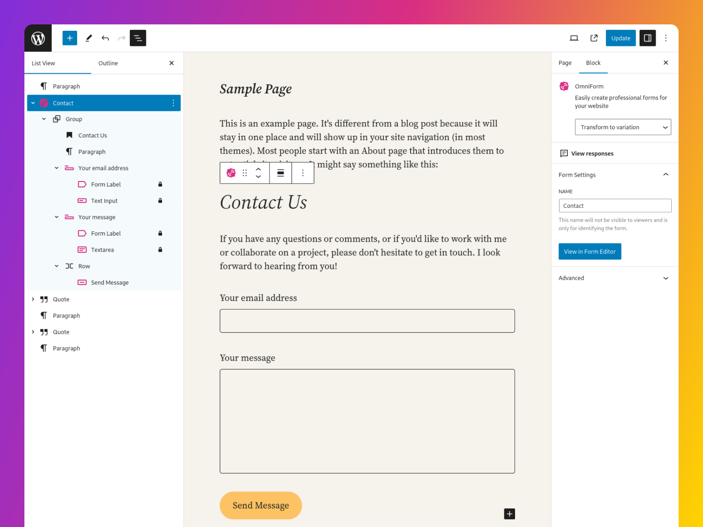
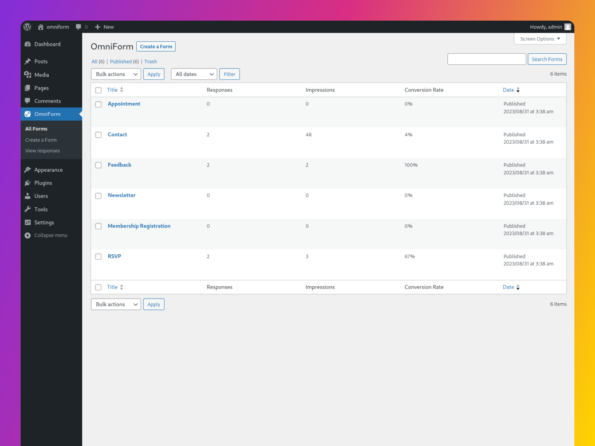

# OmniForm: Form Building inside the Block Editor

[](https://omniform.io/)

OmniForm is a powerful WordPress plugin that allows you to create and manage forms within your WordPress site.

## Requirements

- PHP 7.4+
- [WordPress](http://wordpress.org/) 6.6+

## Installation

**Automatic installation**

To do an automatic install of OmniForm, log in to your WordPress dashboard, navigate to the Plugins menu, and click “Add New.”

In the search field type “OmniForm,” then click “Search Plugins.” Once you’ve found us, you can click “Install Now” and WordPress will take it from there.

**Manual installation**

Manual installation method requires [downloading the OmniForm plugin](https://wordpress.org/plugins/omniform) and uploading it to your web server via your favorite FTP application. The WordPress codex contains [instructions on how to do this here](https://wordpress.org/support/article/managing-plugins/#manual-plugin-installation).

**[WP-CLI](https://wp-cli.org) Installation**

```bash
wp plugin install omniform --activate
```

## Documentation

For detailed documentation on using and extending OmniForm, see [docs/README.md](docs/README.md).

## Development

Clone this repository:
```
git clone https://github.com/jrtashjian/omniform.git
```

Install [PHP-Scoper](https://github.com/humbug/php-scoper) globally and run it to prefix required dependencies:
```
composer global require humbug/php-scoper && composer run phpscoper
```

Install the necessary Node.js and Composer dependencies:
```
composer install && npm install
```

Run the development build which will watch for changes:
```
npm run start
```

## Screenshots

[](https://wordpress.org/plugins/omniform/)
*OmniForm enhances Block Editor with a specialized form-only editing option.*

[](https://wordpress.org/plugins/omniform/)
*Save Time and Effort: Use OmniForm's Ready-to-Customize Form Templates.*

[](https://wordpress.org/plugins/omniform/)
*Create Forms Directly in WordPress Posts or Pages with OmniForm.*

[](https://wordpress.org/plugins/omniform/)
*Get Insights on Form Performance: Responses, Impressions, and Conversion Rate.*

[](https://wordpress.org/plugins/omniform/)
*OmniForm Keeps You Informed: Track Submissions and Get Email Notifications within WordPress.*
